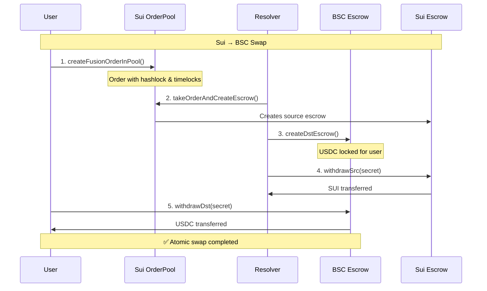

# 📚 Technical Guide - Cross-Chain Fusion+ Implementation

This document provides detailed technical information for developers working with the Cross-Chain Fusion+ protocol implementation.

## 🔍 Detailed Architecture

### **Protocol Flow Overview**

The Cross-Chain Fusion+ implementation follows a sophisticated multi-stage atomic swap protocol:



### **Smart Contract Architecture**

#### **Sui Move Contracts**

```move
// Core modules structure
module cross_chain_swap::order_pool {
    struct OrderPool<phantom T> has key, store
    struct PendingOrder has store
    struct OrderImmutables has copy, store
    
    public fun create_fusion_order<T>(...) -> String
    public fun take_order_and_create_escrow<T>(...) -> ID
    public fun cancel_order<T>(...) 
}

module cross_chain_swap::escrow_factory {
    struct EscrowFactory has key
    struct EscrowSrc<phantom T> has key, store
    struct EscrowDst<phantom T> has key, store
    
    public fun create_src_escrow<T>(...) -> ID
    public fun create_dst_escrow<T>(...) -> ID
    public fun withdraw_src<T>(...) 
    public fun withdraw_dst<T>(...) 
}

module cross_chain_swap::timelock {
    struct TimeLocks has copy, store, drop
    
    public fun create_timelocks(...) -> TimeLocks
    public fun validate_timelock_stage(...) -> bool
}
```

#### **BSC Solidity Contracts**

```solidity
// EscrowFactory.sol
contract EscrowFactory {
    struct EscrowParams {
        bytes32 hashlock;
        address maker;
        address taker;
        address token;
        uint256 amount;
        uint256 safetyDeposit;
        bytes32 timelocksData;
    }
    
    function createSrcEscrow(EscrowParams memory params) 
        external payable returns (address);
    
    function createDstEscrow(EscrowParams memory params) 
        external payable returns (address);
}

// Resolver.sol  
contract Resolver {
    function withdrawSrc(address escrow, bytes32 secret) external;
    function withdrawDst(address escrow, bytes32 secret) external;
    function cancelEscrow(address escrow) external;
}
```

## 🔧 API Reference

### **CrossChainClient Class**

The main client for interacting with both BSC and Sui blockchains.

#### **Constructor**

```typescript
constructor(
  bscAccount?: { address: string } | null,
  suiAccount?: WalletAccount | null,
  bscWalletClient?: WalletClient | null,
  suiSignTransaction?: ((transaction: Transaction) => Promise<SignedTransaction>) | null
)
```

#### **Sui Operations**

##### **createSuiFusionOrderInPool**

Creates a new order in the Sui OrderPool with Fusion+ parameters.

```typescript
async createSuiFusionOrderInPool(params: {
  maker: string;           // Maker's Sui address
  taker: string;           // Taker's address (resolver)
  token: string;           // Token type (e.g., '0x2::sui::SUI')
  amount: string;          // Amount in token's base units
  safetyDeposit: string;   // Safety deposit amount
  timelocksData: string;   // Serialized timelock data
  auctionStartTime?: number;
  auctionEndTime?: number;
  initialRateBump?: number;
  // ... additional Fusion+ parameters
}): Promise<string>       // Returns order hash
```

**Example:**
```typescript
const orderHash = await client.createSuiFusionOrderInPool({
  maker: '0x123...',
  taker: '0x456...',
  token: '0x2::sui::SUI',
  amount: '1000000000',     // 1 SUI
  safetyDeposit: '100000000', // 0.1 SUI
  timelocksData: timelockData,
  auctionStartTime: Math.floor(Date.now() / 1000),
  auctionEndTime: Math.floor(Date.now() / 1000) + 3600,
  initialRateBump: 1000,    // 10% initial rate bump
});
```

##### **takeOrderAndCreateEscrow**

Resolver takes an order from the pool and creates source escrow.

```typescript
async takeOrderAndCreateEscrow(orderHash: string): Promise<string>
```

##### **cancelOrderInPool**

Cancels an order and refunds the maker.

```typescript
async cancelOrderInPool(orderHash: string): Promise<void>
```

##### **Pool Utilities**

```typescript
// Check if order exists in pool
async orderExistsInPool(orderHash: string): Promise<boolean>

// Get pool statistics
async getPoolStats(): Promise<{
  totalOrders: number;
  totalVolume: string;
  activeOrders: number;
}>

// Get order details
async getOrderDetails(orderHash: string): Promise<OrderImmutables | null>
```

#### **BSC Operations**

##### **createBscEscrow**

Creates an escrow contract on BSC.

```typescript
async createBscEscrow(params: {
  hashlock: string;        // 32-byte hex string
  maker: string;           // Maker's address
  taker: string;           // Taker's address
  token: string;           // Token contract address
  amount: string;          // Amount in wei/token units
  safetyDeposit: string;   // Safety deposit amount
  timelocksData: string;   // Encoded timelock data
}): Promise<string>        // Returns escrow contract address
```

##### **withdrawBscEscrow**

Withdraws funds from BSC escrow using secret.

```typescript
async withdrawBscEscrow(
  escrowAddress: string,   // Escrow contract address
  secret: string           // 32-byte secret
): Promise<void>
```

#### **Utility Functions**

##### **computeFusionOrderHash**

Calculates order hash using Fusion+ compatible algorithm.

```typescript
static computeFusionOrderHash(params: {
  maker: string;
  taker: string;
  token: string;
  amount: string;
  safetyDeposit: string;
  timelocksData: string;
  // ... all Fusion+ parameters
}): string                 // Returns 32-byte hex hash
```

##### **generateSecret**

Generates cryptographically secure random secret.

```typescript
static generateSecret(): string  // Returns 32-byte hex secret
```

##### **hashSecret**

Hashes a secret using Keccak256.

```typescript
static hashSecret(secret: string): string  // Returns 32-byte hash
```

### **DemoResolver Class**

Simulates resolver behavior for testing and development.

#### **Constructor**

```typescript
constructor(
  onProgressUpdate?: (orderId: string, progress: SwapProgress) => void,
  onSwapComplete?: (order: SwapOrder) => void
)
```

#### **Methods**

```typescript
// Get resolver status
getStatus(): { 
  available: boolean; 
  mode: 'live' | 'mock' | 'unavailable' 
}

// Check if running in mock mode
isInMockMode(): boolean

// Start/stop resolver
start(): void
stop(): void

// Process orders
async processOrderFromSui(orderHash: string): Promise<SwapOrder>
async processOrderFromBsc(orderHash: string): Promise<SwapOrder>

// Order management
addOrder(order: SwapOrder): void
getOrder(orderId: string): SwapOrder | undefined
getAllOrders(): SwapOrder[]
```

### **React Hooks**

#### **useCrossChainClient**

Returns a configured CrossChainClient instance.

```typescript
const client = useCrossChainClient()
```

#### **useCrossChainTokens**

Manages cross-chain token data.

```typescript
const { 
  tokens,                    // All available tokens
  getTokensByChain,         // Filter tokens by chain
  addToken,                 // Add custom token
  removeToken               // Remove token
} = useCrossChainTokens()
```

#### **Wallet Hooks**

```typescript
// EVM wallet (via Wagmi)
const { isConnected, address } = useAccount()
const { data: walletClient } = useWalletClient()

// Sui wallet
const { isConnected, account } = useSuiAccount()
const { network, switchNetwork } = useSuiNetwork()
const { signTransaction } = useSuiWallet()
```

## 🔒 Security Considerations

### **Hash Time-Locked Contracts (HTLC)**

The protocol uses HTLC for atomic swap security:

1. **Hashlock**: Each escrow requires a secret to unlock
2. **Timelock**: Automatic refund after expiration
3. **Secret Revelation**: Enables atomic completion

### **Timelock Structure**

```typescript
interface TimeLocks {
  srcWithdrawDelay: number;    // Delay before src withdrawal
  dstWithdrawDelay: number;    // Delay before dst withdrawal  
  srcCancelDelay: number;      // Delay before src cancellation
  dstCancelDelay: number;      // Delay before dst cancellation
}

// Typical values for security:
const safeLocks = {
  srcWithdrawDelay: 0,         // Immediate for resolver
  dstWithdrawDelay: 300,       // 5 min for user
  srcCancelDelay: 7200,        // 2 hours fallback
  dstCancelDelay: 3600         // 1 hour fallback
}
```

### **Order Hash Verification**

Orders use deterministic hashing for integrity:

```typescript
// Sui uses BCS serialization + Keccak256
const orderHash = keccak256(
  bcs.ser('vector<u8>', bcsBytes).toBytes()
)

// BSC uses EIP-712 typed data
const orderHash = ethers.utils._TypedDataEncoder.hash(
  domain, types, values
)
```

### **Signature Verification**

All orders require valid maker signatures:

```typescript
// Sui: Verify against order maker
public fun verify_maker_signature(
  order: &OrderImmutables,
  signature: vector<u8>
): bool

// BSC: Recover signer from signature
function recoverSigner(
  bytes32 hash,
  bytes memory signature
) internal pure returns (address)
```

## 🧪 Testing Framework

### **Test Categories**

1. **Unit Tests**: Individual function testing
2. **Integration Tests**: Cross-chain flow testing
3. **E2E Tests**: Full user journey testing
4. **Security Tests**: Attack vector testing

### **Mock Environments**

The testing framework provides multiple mock levels:

```typescript
// Frontend-only mocking
const mockResolver = new DemoResolver()
mockResolver.isInMockMode() // returns true

// Blockchain mocking with Anvil (BSC) + Sui Localnet
const testClient = new CrossChainClient(
  testBscAccount,
  testSuiAccount,
  mockWalletClient,
  mockSuiTransaction
)

// Full integration with testnets
const integrationClient = new CrossChainClient(
  realBscAccount,
  realSuiAccount,
  realWalletClient,
  realSuiTransaction
)
```

### **Test Data Generation**

```typescript
// Generate test orders
function createTestOrder(overrides = {}): FusionOrderParams {
  return {
    maker: '0x' + 'a'.repeat(40),
    taker: '0x' + 'b'.repeat(40),
    token: '0x2::sui::SUI',
    amount: '1000000000',
    safetyDeposit: '100000000',
    timelocksData: generateTestTimelocks(),
    ...overrides
  }
}

// Generate test secrets
function createTestSecret(): string {
  return '0x' + crypto.randomBytes(32).toString('hex')
}
```

## 🚀 Deployment Guide

### **Contract Deployment**

#### **Sui Deployment**

```bash
# Build package
cd sui
sui move build

# Deploy to testnet
sui client publish --gas-budget 20000000

# Initialize factory
sui client call \
  --package $PACKAGE_ID \
  --module escrow_factory \
  --function init_factory \
  --args 3600 7200  # src_delay, dst_delay

# Create order pool
sui client call \
  --package $PACKAGE_ID \
  --module order_pool \
  --function create_pool \
  --type-args 0x2::sui::SUI
```

#### **BSC Deployment**

```bash
# Deploy with Hardhat
cd bsc
npx hardhat deploy --network bsc-testnet

# Verify contracts
npx hardhat verify --network bsc-testnet \
  $FACTORY_ADDRESS \
  $RESOLVER_ADDRESS
```

### **Environment Configuration**

Create production environment files:

```typescript
// production.config.ts
export const PRODUCTION_CONFIG = {
  networks: {
    bsc: {
      chainId: 56,
      rpcUrl: 'https://bsc-dataseed.binance.org',
      factory: '0x...', // Deployed factory address
      resolver: '0x...', // Deployed resolver address
    },
    sui: {
      network: 'mainnet',
      rpcUrl: 'https://fullnode.mainnet.sui.io',
      packageId: '0x...', // Published package ID
      poolId: '0x...', // Created pool ID
    }
  },
  features: {
    resolverSimulation: false, // Disable for production
    testMode: false,
  }
}
```

### **Monitoring and Analytics**

#### **Event Monitoring**

```typescript
// Monitor BSC events
const factory = new ethers.Contract(factoryAddress, abi, provider)
factory.on('EscrowCreated', (escrowAddress, maker, amount) => {
  console.log('New BSC escrow:', escrowAddress)
  // Send to analytics
})

// Monitor Sui events
const client = new SuiClient({ url: rpcUrl })
client.subscribeEvent({
  filter: { Package: packageId },
  onMessage: (event) => {
    if (event.type.includes('OrderCreated')) {
      console.log('New Sui order:', event)
      // Send to analytics
    }
  }
})
```

#### **Health Checks**

```typescript
// System health monitoring
async function checkSystemHealth() {
  const health = {
    bsc: await checkBscHealth(),
    sui: await checkSuiHealth(),
    resolver: await checkResolverHealth(),
    ui: await checkUIHealth()
  }
  
  return {
    status: Object.values(health).every(h => h.ok) ? 'healthy' : 'degraded',
    components: health,
    timestamp: new Date().toISOString()
  }
}
```

## 🔧 Advanced Configuration

### **Custom Token Support**

Add new tokens to the system:

```typescript
// Add custom BSC token
const customBscToken: CrossChainToken = {
  id: 'bsc-custom',
  name: 'Custom Token',
  symbol: 'CUSTOM',
  logo: '/custom-logo.png',
  balance: 0,
  price: 1.0,
  chain: 'BSC',
  chainLogo: '/bsc-logo.png',
  contractAddress: '0x...',
  decimals: 18
}

// Add custom Sui token
const customSuiToken: CrossChainToken = {
  id: 'sui-custom',
  name: 'Custom Sui Token',
  symbol: 'CSUI',
  logo: '/custom-sui-logo.png',
  balance: 0,
  price: 2.0,
  chain: 'SUI',
  chainLogo: '/sui-logo.png',
  contractAddress: '0x...::custom::CUSTOM',
  decimals: 9
}

// Register tokens
const { addToken } = useCrossChainTokens()
addToken(customBscToken)
addToken(customSuiToken)
```

### **Resolver Configuration**

Configure resolver behavior:

```typescript
const resolverConfig = {
  // Profit thresholds
  minProfitBps: 50,        // 0.5% minimum profit
  maxSlippageBps: 100,     // 1% maximum slippage
  
  // Timing parameters
  bidDelayMs: 5000,        // 5s delay before bidding
  executionTimeoutMs: 30000, // 30s execution timeout
  
  // Gas management
  maxGasPrice: '20000000000', // 20 gwei max
  gasLimitMultiplier: 1.2,    // 20% gas limit buffer
  
  // Risk management
  maxPositionSize: '1000000000000', // Max position size
  blacklistedTokens: [],             // Blacklisted token addresses
}
```

This technical guide provides comprehensive information for developers working with the Cross-Chain Fusion+ implementation. For additional support, please refer to the main README or contact the development team.