# Sui Cross-Chain Swap with Fusion+ Integration

A comprehensive cross-chain atomic swap implementation on Sui blockchain, integrating with 1inch Fusion+ protocol for competitive resolver bidding and secure cross-chain transactions.

## 🏗️ Architecture Overview

This project implements a decentralized cross-chain swap mechanism that combines:

- **OrderPool**: Competitive bidding system for resolvers
- **Escrow System**: Hash Time-Locked Contracts (HTLC) for atomic swaps
- **Fusion+ Integration**: Complete compatibility with 1inch Fusion+ order structure
- **Cross-Chain Bridge**: Sui ↔ BSC (and other EVM chains) interoperability

## 📚 Core Components

### 1. Order Pool (`order_pool.move`)

The OrderPool is the heart of the competitive resolver system, enabling users to create orders that resolvers can bid on.

#### Key Features:
- **Competitive Bidding**: Resolvers compete to fulfill user orders
- **Fund Escrow**: Safely holds user funds until order completion
- **Fusion+ Compatibility**: Supports all 1inch Fusion+ order parameters
- **Timelock Protection**: Automatic cancellation and refund mechanisms

#### OrderPool Structure:
```move
public struct OrderPool has key, store {
    id: UID,
    total_orders: u64,
    active_orders: u64,
    total_volume: u64,
}

public struct PendingOrder<phantom T> has key, store {
    id: UID,
    order_hash: vector<u8>,
    maker: address,
    tokens: Balance<T>,
    safety_deposit: Balance<SUI>,
    immutables_template: OrderImmutables,
    expiry: u64,
    status: u8, // 0: Active, 1: Taken, 2: Cancelled
    auction_config: AuctionConfig,
    whitelist: vector<address>,
}
```

#### Complete Fusion+ Order Parameters:
```move
public struct OrderImmutables has copy, drop, store {
    // Core identification
    order_hash: vector<u8>,
    hashlock: vector<u8>,
    salt: u256,
    nonce: u256,
    
    // Participants and assets
    maker: address,
    taker: address,
    maker_asset: address,
    taker_asset: address,
    
    // Amounts
    making_amount: u64,
    taking_amount: u64,
    safety_deposit: u64,
    
    // Cross-chain information
    src_chain_id: u64,
    dst_chain_id: u64,
    src_safety_deposit: u64,
    dst_safety_deposit: u64,
    
    // Resolver configuration
    public_key: vector<u8>,
    resolver_address: address,
    resolver_fee: u64,
    // ... additional fee parameters
    
    // Timelock constraints
    timelocks_data: u256,
}
```

### 2. Escrow System

The escrow system implements Hash Time-Locked Contracts (HTLC) for secure atomic swaps.

#### Components:
- **`base_escrow.move`**: Common escrow functionality and data structures
- **`escrow_src.move`**: Source chain escrow (where user's funds originate)
- **`escrow_dst.move`**: Destination chain escrow (where user receives funds)
- **`timelock.move`**: Multi-stage timelock validation system

#### Escrow Lifecycle:
1. **Creation**: Resolver creates escrow with hashlock
2. **Funding**: Funds are locked with secret hash
3. **Reveal**: Secret is revealed to unlock funds
4. **Withdrawal**: Authorized parties can withdraw based on timelock stages

#### Timelock Stages:
```move
public struct TimelockData has copy, drop, store {
    src_cancellation: u64,     // User can cancel source escrow
    dst_cancellation: u64,     // User can cancel destination escrow
    src_withdrawal: u64,       // Resolver can withdraw from source
    dst_withdrawal: u64,       // User can withdraw from destination
}
```

### 3. Cross-Chain Flow Architecture

```mermaid
graph TD
    A[User Creates Order] --> B[Funds Locked in OrderPool]
    B --> C[Resolver Bids and Wins]
    C --> D[Resolver Creates SrcEscrow]
    D --> E[Funds Transfer: Pool → SrcEscrow]
    E --> F[Resolver Creates DstEscrow on Target Chain]
    F --> G[User Withdraws with Secret Reveal]
    G --> H[Resolver Withdraws with Revealed Secret]
    
    I[Fallback: Timelock Expiry] --> J[Automatic Cancellation/Refund]
```



## 🔄 Complete Cross-Chain Swap Flow

### Phase 1: Order Creation (Sui)
1. **User** calls `create_order()` or `create_fusion_order()`
2. User's tokens + safety deposit locked in OrderPool
3. Order becomes available for resolver bidding

### Phase 2: Resolver Competition (Sui)
1. **Resolvers** monitor OrderPool for profitable orders
2. Winner calls `take_order_and_create_escrow()`
3. Funds transfer from OrderPool to newly created SrcEscrow
4. Order is consumed from pool

### Phase 3: Cross-Chain Execution
1. **Resolver** creates DstEscrow on target chain (e.g., BSC)
2. **Resolver** deposits target tokens (e.g., USDC) in DstEscrow
3. **User** withdraws from DstEscrow using secret, revealing hashlock
4. **Resolver** uses revealed secret to withdraw from SrcEscrow

### Phase 4: Fallback Protection
- **Timelock Expiry**: Automatic cancellation if conditions not met
- **User Refund**: Users can recover funds if swap fails
- **Resolver Protection**: Resolvers can recover funds after user withdrawal window

## 🛠️ Usage Guide

### For Users (Order Creators)

#### Basic Order Creation:
```move
// Simple order (backward compatible)
public fun create_order<T>(
    pool: &mut OrderPool,
    tokens: Coin<T>,
    safety_deposit: Coin<SUI>,
    order_hash: vector<u8>,
    hashlock: vector<u8>,
    timelocks_data: u256,
    ctx: &mut TxContext
): ID
```

#### Complete Fusion+ Order:
```move
// Full Fusion+ order with all parameters
public fun create_fusion_order<T>(
    pool: &mut OrderPool,
    tokens: Coin<T>,
    safety_deposit: Coin<SUI>,
    // All Fusion+ parameters...
    ctx: &mut TxContext
): ID
```

### For Resolvers (Order Takers)

#### Taking Orders:
```move
public fun take_order_and_create_escrow<T>(
    pool: &mut OrderPool,
    order_id: ID,
    resolver_safety_deposit: Coin<SUI>,
    clock: &Clock,
    ctx: &mut TxContext
): ID // Returns SrcEscrow ID
```

### TypeScript Integration

The project includes a comprehensive TypeScript client (`sui-client.ts`) for easy integration:

```typescript
// Create Fusion+ order
await suiClient.createFusionOrderInPool(
    poolId,
    tokenAmount,
    safetyAmount,
    orderHash,
    hashlock,
    salt,
    nonce,
    // ... all Fusion+ parameters
);

// Resolver takes order
const srcEscrowId = await resolverClient.takeOrderAndCreateEscrow(
    poolId,
    orderId,
    resolverSafetyDeposit
);
```

## 🧪 Testing

The project includes comprehensive end-to-end tests:

### Run Sui Move Tests:
```bash
sui move test --path sui
```

### Run Cross-Chain Integration Tests:
```bash
pnpm test:cross-chain-sui
```

### Test Coverage:
- ✅ Order Pool lifecycle (create, take, cancel)
- ✅ Complete Fusion+ parameter validation
- ✅ Cross-chain swap flows (Sui ↔ BSC)
- ✅ Timelock and escrow mechanics
- ✅ Error handling and edge cases

## 🔧 Key Features

### Security Features:
- **Hash Time-Lock Contracts**: Atomic swap guarantees
- **Multi-stage Timelocks**: Granular control over swap phases
- **Signature Verification**: Maker and resolver authentication
- **Orderbook Protection**: Prevents front-running and MEV attacks

### Performance Optimizations:
- **Sui-Native OrderHash**: Efficient BCS serialization + Keccak256
- **Object Ownership**: Leveraging Sui's object model for gas efficiency
- **Parallel Execution**: Multiple orders can be processed simultaneously

### Developer Experience:
- **TypeScript SDK**: Complete client-side integration
- **Comprehensive Testing**: End-to-end test coverage
- **Error Handling**: Detailed error codes and debugging support
- **Documentation**: Complete API documentation and examples

## 🏃‍♂️ Quick Start

1. **Deploy Contracts**:
```bash
sui client publish --path sui
```

2. **Create Order Pool**:
```bash
sui client call --package $PACKAGE_ID --module order_pool --function create_pool
```

3. **Run Tests**:
```bash
pnpm test:cross-chain-sui
```

## 🤝 Integration with 1inch Fusion+

This implementation maintains full compatibility with 1inch Fusion+ protocol:

- **Order Structure**: Complete alignment with Fusion+ order parameters
- **Hash Calculation**: Compatible orderHash generation for cross-SDK usage
- **Resolver Network**: Pluggable with existing Fusion+ resolver infrastructure
- **Event System**: Standard events for monitoring and indexing

## 📈 Performance Metrics

Based on test results:
- **Order Creation**: ~2-3 seconds on Sui testnet
- **Order Taking**: ~3-5 seconds including escrow creation
- **Cross-Chain Completion**: 5-10 seconds end-to-end
- **Gas Costs**: Optimized for Sui's low-cost execution model

## 🔮 Future Roadmap

- [ ] Advanced auction mechanisms (Dutch auctions, sealed bids)
- [ ] MEV protection enhancements
- [ ] Liquidity aggregation features
- [ ] Governance token integration

---

**Note**: This is a demonstration implementation. Please audit thoroughly before mainnet deployment.